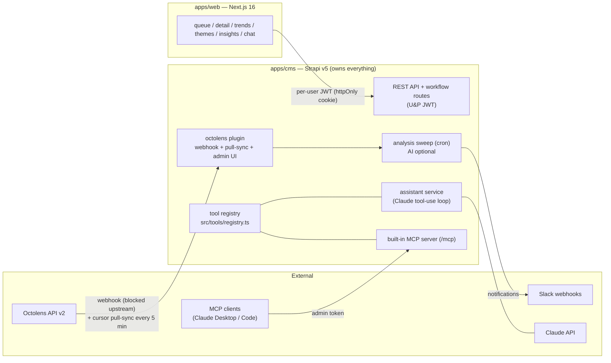
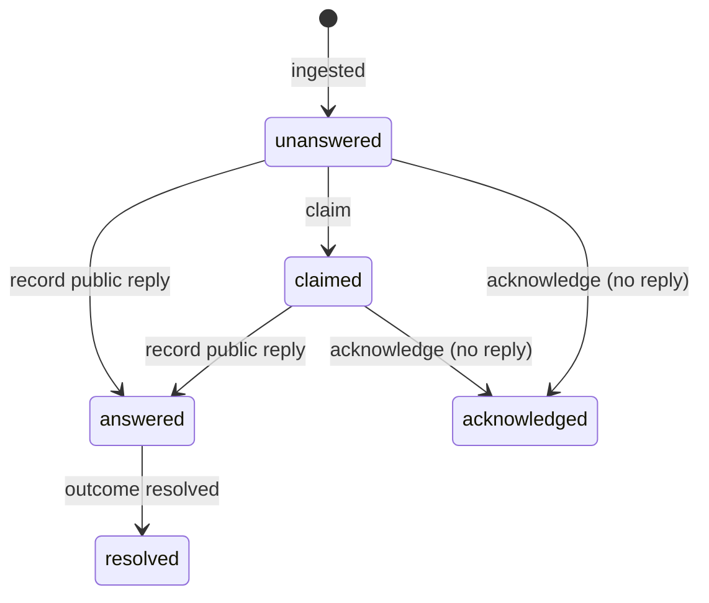

# Pulse — Architecture

Pulse is a single-instance internal tool: it aggregates social mentions of Strapi (via Octolens), tracks sentiment and the team's response trail, and turns recurring signals into product insight. One Strapi v5 backend owns all data and integrations; a Next.js frontend is a thin, replaceable view layer.

## Monorepo layout

| Path | What it is |
|---|---|
| `apps/cms` | Strapi v5 backend — all business logic, integrations, crons, MCP |
| `apps/cms/src/api/*` | Feature modules (mention, response, topic, analysis, search, assistant, notify, …) — plain `src/api` folders by default |
| `apps/cms/src/plugins/octolens` | Local plugin (sdk-plugin layout) — the one module that earned plugin-hood: it ships an admin UI (sync page + widget) |
| `apps/cms/src/tools/registry.ts` | **Single tool registry** consumed by both the MCP server and the in-app assistant |
| `apps/cms/src/api/*/services` | Workflow logic: transition guards + transactions (controllers are thin ctx adapters) |
| `apps/cms/src/utils/dedupe-mentions.ts` | Boot-time integrity: duplicate merge + unique/hot-filter DB indexes |
| `apps/web/lib/{pulse-client,types}.ts` | The one client-side API helper + shared wire types |
| `apps/web/app/providers.tsx` | TanStack Query provider — **mutation state only** (26 `useMutation` sites) plus one cached query (search). No polling; freshness is `router.refresh()`. Auth uses server actions + `useActionState` instead, since sign-in is a form submit with redirect semantics |
| `apps/web/components/{ui,timeline/}` | Shared UI atoms; timeline split into entry/card/composer parts |
| `apps/cms/src/mcp` | Registers registry tools on the built-in MCP server + their admin permission actions |
| `apps/web` | Next.js 16 App Router frontend (Epic Next auth pattern, DevFlow-style UI) |
| `apps/web/e2e` | Playwright suite (18 tests) — injects data through the real webhook |
| `0*.md` | The six-stage product spec (living docs; `06-build-spec.md` carries the revision log) |

## Data model

- **mention** — one social post. `externalId` (dedupe), content/author/url/postedAt, `channel`, sentiment (`sentimentLabel`, `sentimentScore`, provenance via `modelVersion`/`promptVersion`, `humanCorrected`), workflow `status`, `acknowledgeReason`, `topics` (m2m), pending `draftText`/`draftedAt`/`draftedVia`, `raw` (original payload, never exposed via API).
- **response** — what the team replied (or an `internal: true` note that never leaves the team). `finalText`, `draftText`, `notes`, outcome component.
- **activity** — append-only audit trail per mention (`ingested`, `analyzed`, `claimed`, `routed`, `corrected`, `answered`, `resolved`, `replayed`, `acknowledged`, `noted`, `drafted`).
- **topic** — theme mentions cluster into (`kind`: feature/bug/docs/competitor/other). Machine-created (AI clustering or competitor auto-tagging), admin-curated, and mintable inline from the labeling panel.
- **channel / event / dead-letter** — platforms, annotated timeline events, and failed webhook payloads (nothing is silently dropped).

### Mention workflow

**The diagram is executable, not decorative.** Every transition lives in a service method
(`api::mention` claim/acknowledge/route/correct/replay, `api::response` record/recordOutcome) that
(a) re-checks the current status **inside** a `strapi.db.transaction` under a `forUpdate` row lock —
so two concurrent claims can't both win — (b) writes the change and its activity row atomically, and
(c) throws `WorkflowError` (409/400/404) that controllers map to responses. Slack notifications run
after commit. Legal sources: claim ← `unanswered`; acknowledge ← `unanswered`/`claimed`; answer ←
any status (a real reply re-opens an acknowledged or resolved mention); resolve ← `answered`, and
only from a **public** reply's outcome.

`acknowledged` closes a mention **without** a public reply (reason: `competitor` / `not-relevant` / `watching`) — it leaves the queue but keeps full analytics value, because trends/themes key off `analysisStatus`, not workflow status. Internal notes (`response.internal`) record team commentary at any point without changing status.

## Ingestion (all Strapi-side, by design)

Two paths share one intake service (`plugins/octolens/server/src/services/intake.ts`) — same dedupe, channel mapping, and activity trail:

1. **Pull-sync (primary)** — cursor-paginated `POST /api/v2/mentions`, cron every 5 min (`OCTOLENS_SYNC_CRON`), manual "Sync now" in the plugin's admin page. Filters `relevance !== 'irrelevant'`.
2. **Webhook (ready, blocked upstream)** — `POST /api/octolens/ingest` guarded by a shared secret (`x-pulse-secret` header or `?secret=`). Octolens' URL validator currently false-positives on Strapi Cloud's Cloudflare IPs (bug reported); the endpoint is live and verified.

**Integrity guarantees** (each earned from a real incident): a real DB unique index on
`mentions.external_id` — Strapi's `unique: true` is validation-layer only and Document Service
writes bypass it — plus create-catch-refetch in the writer and an in-process overlap guard on the
sync; a boot-time pass that **merges** any pre-existing duplicates (re-parenting responses/comments/
activities to the keeper) before ensuring the index; per-item error isolation in the sync loop so
one bad record can't poison the run (failures dead-letter once per item, with one aggregated ops
alert per run); a `truncated` flag when the page cap stops a run early; and
`POST /api/dead-letters/:documentId/replay` to re-run a stored payload through the same
normalize + intake path.

Competitor signal is captured at intake: Octolens' `tags: ["competitor_mention"]` / `keywords[].keywordTag: "competitor"` auto-create and attach `kind: competitor` topics (e.g. `#Payload`).

## AI is optional — never faked

Everything except three features works with no AI key. With `AI_API_KEY` unset:

- Sentiment: Octolens' own label is adopted at intake with explicit provenance (`modelVersion: 'octolens'`, `promptVersion: 'label-map-v1'`, coarse score map ±0.5); otherwise mentions are marked `skipped` for manual labeling.
- Drafts and chat are cleanly disabled (503 / hidden UI), not degraded with heuristics.
- Adding a key later auto-analyzes previously skipped mentions via the cron sweep; human corrections are never overwritten.

**The Pulse score** (single implementation in `api::analysis.insights`): per UTC day, the volume-weighted mean of `sentimentScore` over a trailing 7-day window, scaled to 0–100 via `(mean + 1) × 50`.

## One tool registry, two AI surfaces

`src/tools/registry.ts` defines each tool once — name, description, zod v4 input schema, handler. Consumers:

- **Built-in MCP server** (`/mcp`, GA since Strapi 5.49) — `src/mcp/index.ts` loops the registry in `register()`.
- **In-app assistant** (`api::assistant.answer`) — a Claude API tool-use loop; `z.toJSONSchema()` bridges the same schemas to the Messages API.

Tools (9): `pulse-queue` (semantic filters — `draft: no-draft|has-draft`, status, sentiment, topic,
search — paged, excerpt-trimmed, relations as names), `pulse-get-mention` (context + similar past
replies), `pulse-save-draft`, `pulse-update-mention` (**partial by construction**),
`pulse-save-drafts-bulk` (25/call), `pulse-acknowledge`, `pulse-search-mentions`,
`pulse-trend-summary`, `pulse-theme-report`.

**Agent-safety design** (after a real session with Strapi's generic content-manager tools silently
overwrote a long post): our write tools never expose `content`, so a truncated resend can't destroy
a body; draft writes are conditional (refuse to replace an existing draft unless `overwrite: true`);
results carry a wire-size guard measuring the *doubled* MCP payload and return an actionable
`RESULT_TOO_LARGE` instead of an opaque client error. Operational rule: **scope MCP tokens to the
"Pulse MCP tools" actions only** — adding content-manager permissions re-exposes the generic CRUD
tools. The draft loop is human-in-the-loop by construction: agents save `draftText`, the queue shows
a "draft ready" chip, the reply form pre-fills, a human posts on the platform and records the real
reply (which consumes the draft). **Nothing auto-posts.**

## Permissions model (three registries, kept distinct)

| Surface | Mechanism | Where it's managed |
|---|---|---|
| Frontend users | U&P role permissions, seeded idempotently in `src/index.ts` bootstrap (registration closed; accounts admin-invited) | code (seed list `AUTHENTICATED_ACTIONS`) |
| MCP tools | One admin permission action per tool (`api::pulse-mcp.<tool>`) — a tool's action is its **only** gate. Registered in `register()`, **not** `bootstrap()`: admin's bootstrap prunes grants for unknown actions, which silently wiped token checkboxes on every restart | Admin Token / Role screens → **Settings** tab → "Pulse MCP tools" |
| Octolens plugin admin UI | `plugin::octolens.settings.read` / `plugin::octolens.sync.start`, gating routes, menu link, and widget | Roles / Admin Token screens → **Plugins** tab → octolens |

Which tab a permission lands on is set by `section` (`plugins` → Plugins tab, grouped by plugin;
`settings` → Settings tab, grouped by `category`), while `pluginName` sets the action-id prefix
(omitted → `api::`, else `plugin::<name>.`). Plugin-owned capability → `plugins`; app-level
capability (custom routes, MCP tools) → `settings`.

Sessions: `jwtManagement: 'legacy-support'` with `jwt.expiresIn: '7d'`, matching the 7-day httpOnly
cookie. (Refresh mode issues 10-minute access tokens by default and the frontend has no rotation
loop yet — parked, deliberate, recorded in the spec revision log.)

User data exposure is deliberately minimal: only `/api/users/me` is exposed; user relations in API responses are whitelisted to `id`/`documentId`/`username` (Strapi's sanitizer strips U&P relations entirely, so controllers re-shape explicitly).

## Scheduled jobs

| Cron | Default | Purpose |
|---|---|---|
| `analysisSweep` | every minute | analyze `pending` mentions (or apply Octolens labels keyless). Overlap-guarded; failures retry to a cap then park with ONE ops alert |
| `octolensSync` | every 5 min | pull-sync reconciliation |
| `nightlyRecluster` | 03:00 | AI topic clustering (no-op keyless; corrections preserved) |
| `staleDigest` | 09:00 weekdays | Slack digest of stale unanswered mentions (`STALE_AFTER_DAYS`, default 2) |
| `budgetReset` | midnight | resets the AI daily token budget |

## Testing & CI

Playwright e2e (18 tests) runs against real dev servers with data injected through the actual webhook — sign-in once via storageState, tests are data-volume independent. CI (`.github/workflows/ci.yml`) boots the full stack keyless (AI-optional is exercised on every run) and runs the suite.
